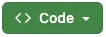

# Guess The Phrase

## Overview

Guess The Phrase - brief description

TODO: ADD MOCKUP?

## Table of Contents

- [Guess The Phrase](#guess-the-phrase)
  - [Overview](#overview)
  - [Table of Contents](#table-of-contents)
  - [Intro](#intro)
  - [Features](#features)
    - [Header](#header)
    - [Main](#main)
    - [Footer](#footer)
    - [Future Features](#future-features)
  - [Manual Testing](#manual-testing)
    - [Features Testing](#features-testing)
    - [Lighthouse Performance](#lighthouse-performance)
    - [Validator Testing](#validator-testing)
      - [HTML - W3C - Markup Validation Service](#html---w3c---markup-validation-service)
      - [CSS - W3C - CSS Validation Service](#css---w3c---css-validation-service)
      - [JS Validation](#js-validation)
    - [Browser Compatibility](#browser-compatibility)
    - [Screen size responsiveness](#screen-size-responsiveness)
    - [Bugs resolved and unresolved](#bugs-resolved-and-unresolved)
  - [Deployment](#deployment)
    - [**GitHub Pages**](#github-pages)
    - [**Local run**](#local-run)
  - [Credits](#credits)
    - [Software](#software)
    - [Hardware](#hardware)
    - [Inspirations](#inspirations)
    - [Resources](#resources)

## Intro

Introductory content goes here.

## Features

General feature content here.

### Header

Header-specific content here.

### Main

Main content-specific details here.

### Footer

Footer-specific content here.

### Future Features

Future features content here.

## Manual Testing

Introduction or overview of your manual testing.

### Features Testing

How to Features were tested

### Lighthouse Performance

Lighthouse Performance from DevTools

### Validator Testing

Introduction to validator testing.

#### HTML - W3C - Markup Validation Service

Details and results of your HTML validation testing here.

#### CSS - W3C - CSS Validation Service

Details and results of your CSS validation testing here.

#### JS Validation

Details and results of your CSS validation testing here.

### Browser Compatibility

Checked different browsers?

### Screen size responsiveness

Responsiveness

### Bugs resolved and unresolved

Unresolved Bugs: none

## Deployment

### **GitHub Pages**

1. Log in to GitHub and locate [GitHub Repository Guess The Phrase](https://github.com/DaSHdotHub/Guess-the-phrase)
2. At the navigation bar of the repository tab find "Settings", click.
3. At the left side under the "Code and automation" section, click on "Pages".
4. Next locate the "Source" and set it to "Deploy from a branch", branch should be "main", folder set to "root" and then click on the "Save" button.
5. Head back to the [Project Repository](https://github.com/DaSHdotHub/Guess-the-phrase) and on the right side click on [Deployments](https://github.com/DaSHdotHub/Guess-the-phrase/deployments) and under the "Active deployments" section is the freshly deployed project: [Guess The Phrase](https://dashdothub.github.io/Guess-The-Phrase/)

### **Local run**

- In your favourite IDE clone the project, e.g. following the GitHub instructions unter the button .
- Make sure python3 is installed. 
- Inside or outside an IDE run following command from the root directory of the project: 
  <code>phyton3 -m http.server</code>

## Credits

General credit acknowledgements.

### Software

- Visual Studio Code as IDE with following Extensions:
  
- CodeAnywhere as IDE, was changed for VSCode due to limitations during the project.

Software credits go here.

### Hardware

Hardware credits go here.

### Inspirations

List or details of inspirations go here.

### Resources

List or resources used in this project.
