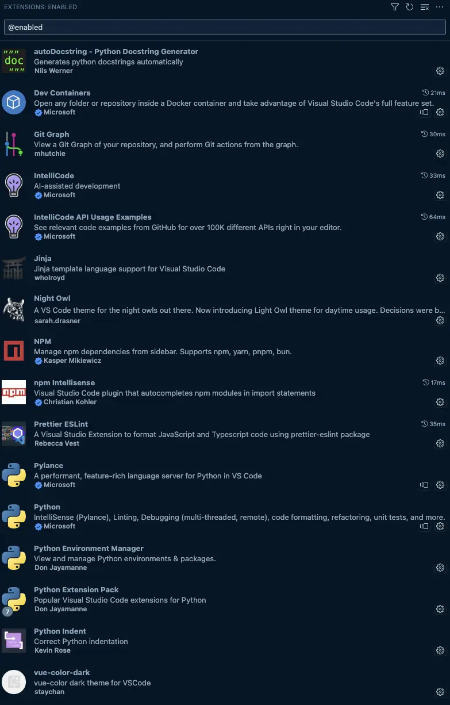

# Guess The Phrase

## Overview

Guess The Phrase - brief description

TODO: ADD MOCKUP?

## Table of Contents

- [Guess The Phrase](#guess-the-phrase)
  - [Overview](#overview)
  - [Table of Contents](#table-of-contents)
  - [Intro](#intro)
  - [Features](#features)
    - [Header](#header)
    - [Main](#main)
    - [Footer](#footer)
    - [Future Features](#future-features)
  - [Manual Testing](#manual-testing)
    - [Features Testing](#features-testing)
    - [Lighthouse Performance](#lighthouse-performance)
    - [Validator Testing](#validator-testing)
      - [HTML - W3C - Markup Validation Service](#html---w3c---markup-validation-service)
      - [CSS - W3C - CSS Validation Service](#css---w3c---css-validation-service)
      - [JS Validation](#js-validation)
    - [Browser Compatibility](#browser-compatibility)
    - [Screen size responsiveness](#screen-size-responsiveness)
    - [Bugs resolved and unresolved](#bugs-resolved-and-unresolved)
  - [Deployment](#deployment)
    - [**GitHub Pages**](#github-pages)
    - [**Local run**](#local-run)
  - [Credits](#credits)
    - [Software](#software)
    - [Hardware](#hardware)
    - [Inspirations](#inspirations)
    - [Resources](#resources)

## Intro

Introductory content goes here.

## Features

General feature content here.

### Header

Header-specific content here.

### Main

Main content-specific details here.

### Footer

Footer-specific content here.

### Future Features

Future features content here.

## Manual Testing

Introduction or overview of your manual testing.

### Features Testing

How to Features were tested

### Lighthouse Performance

#### **Mobile**
Almost perfect score:
 
.
 
You can also view the full [report!](https://dashdothub.github.io/Guess-The-Phrase/assets/media/doc/validator/lighthouse_mobile.html)

#### **Desktop**
Perfect score!
 
.
 
You can also view the full [report!](ttps://dashdothub.github.io/Guess-The-Phrase/assets/media/doc/validator/lighthouse_desktop.html)

### Validator Testing

Introduction to validator testing.

#### **HTML - W3C - Markup Validation Service**

No Errors found, trailing slashes from special tags like '<meta>' were removed for not having any 'INFO' messages in the validator.

Validation result:

#### **CSS - W3C - CSS Validation Service**

No Errors found, warnings were displayed. Imported Fonts could not be checked. CSS variables are currently not statically checked.

Validation result:

#### **JS Validation**

No Errors found, two warnings. Async functions are only available with jshint from ES8

Validation result:

### Browser Compatibility

## Browsers support

|  IE / Edge |  Firefox |  Chrome |  Safari |  iOS Safari |  Opera |
| --------- | --------- | --------- | --------- | --------- | --------- |
| IE11, Edge| last 2 versions| last 2 versions| last 2 versions| last 2 versions| last 2 versions

### Screen size responsiveness

Responsiveness

### Bugs resolved and unresolved

On game end. After all phrases were asked the hint will be overwritten only when a new game will be started.

In the console one error keeps popping out.
 
The error does not hinder any functionality of the webapp or dose have any other influence on the project.

## Deployment

### **GitHub Pages**

1. Log in to GitHub and locate [GitHub Repository Guess The Phrase](https://github.com/DaSHdotHub/Guess-the-phrase)
2. At the navigation bar of the repository tab find "Settings", click.
3. At the left side under the "Code and automation" section, click on "Pages".
4. Next locate the "Source" and set it to "Deploy from a branch", branch should be "main", folder set to "root" and then click on the "Save" button.
5. Head back to the [Project Repository](https://github.com/DaSHdotHub/Guess-the-phrase) and on the right side click on [Deployments](https://github.com/DaSHdotHub/Guess-the-phrase/deployments) and under the "Active deployments" section is the freshly deployed project: [Guess The Phrase](https://dashdothub.github.io/Guess-The-Phrase/)

### **Local run**

- In your favourite IDE clone the project, e.g. following the GitHub instructions unter the button  
.
- Make sure python3 is installed. 
- Inside or outside an IDE run following command from the root directory of the project: 
  <code>phyton3 -m http.server</code>

## Credits

### **Inspirations**

For this project, my assigned mentor encouraged me to go for a quiz game, after a short use of search engines I found this website  
https://www.ef.co.uk/english-resources/english-quotes/famous/ (Link was last checked checked on 01.11.2023)  
Therefore my idea was born to make a game of guessing the correct phrases.

All design patterns were created by myself.

### **Software**

* <strong>Visual Studio Code</strong> as IDE with following Extensions:
  

  
Extensions:

  
  

* <strong>CodeAnywhere</strong> as IDE, was changed in favour of VSCode due to restrictions in CodeAnywhere.
* <strong>QuickTime Player</strong> in combinatiion with <strong>VB Cable</strong> for creating the recordings for the audio files, also trimming them for them just to have the correct length.
* <strong>Google Chrome</strong> for the main development
* <strong>Chrome Dev Tools</strong> for the main development, debugging and logging.
* <strong>Slack</strong> for interaction with my cohort and my mentor.

### **Hardware**

**Used for development:**  
* MacBook Pro M1 (2020)

**Used for Testing:**  
* MacBook Pro M1 (2020)
* Redmi 11S
* iPhone SE (2022)
* iPhone 13 Pro
* iPhone 14 Pro Max

### **Resources**

#### Media
* The texts for introduction, howto and rules were written down by myself, afterwards they were altered by ChatGPT v4 to have a specific language.
* Audio was created with - https://www.naturalreaders.com/online/ (Link was last checked checked on 01.11.2023)
* Images and Screenshots were converted by webservice -  https://convertio.co/ (Link was last checked checked on 01.11.2023)
* Browser compatibility - https://godban.github.io/browsers-support-badges/ (Link was last checked checked on 01.11.2023)

### **Also**

* Big thanks to my wife and my child who are always supporting me at their best :-) 