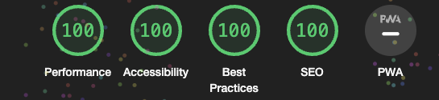

# Guess The Phrase

## Introduction

[Guess The Phrase]() is a fun quiz game that features 25 phrases. These phrases, sourced from movies, theaters, books, and even pangrams, have been jumbled by a computer algorithm that added *IT key- and buzzwords*. Now, it's up to the user to correct the mistakes made by the algorithm.

The primary goal of this game is not for the user to compete against a computer or another player, but rather to enjoy their time and select the correct answer for each altered phrase. Suitable for all ages.

## Table of Contents

- [Guess The Phrase](#guess-the-phrase)
  - [Introduction](#introduction)
  - [Table of Contents](#table-of-contents)
  - [Features](#features)
    - [Header](#header)
    - [Main](#main)
    - [Footer](#footer)
    - [Future Features (not planned)](#future-features-not-planned)
  - [Design](#design)
  - [Technologies, Libraries \& Sources](#technologies-libraries--sources)
    - [**Technologies**](#technologies)
    - [**Libraries \& Sources**](#libraries--sources)
  - [Frameworks, Software \& Hardware](#frameworks-software--hardware)
    - [**Frameworks**](#frameworks)
    - [**Software**](#software)
    - [**Hardware**](#hardware)
  - [Manual Testing](#manual-testing)
    - [Features Testing](#features-testing)
      - [**Visuals**](#visuals)
      - [**Logic**](#logic)
    - [Lighthouse Performance](#lighthouse-performance)
      - [**Mobile**](#mobile)
      - [**Desktop**](#desktop)
    - [Validator Testing](#validator-testing)
      - [**HTML - W3C - Markup Validation Service**](#html---w3c---markup-validation-service)
      - [**CSS - W3C - CSS Validation Service**](#css---w3c---css-validation-service)
      - [**JS Validation**](#js-validation)
    - [Browser Compatibility](#browser-compatibility)
  - [Browsers support](#browsers-support)
    - [Screen size responsiveness](#screen-size-responsiveness)
    - [Bugs resolved and unresolved](#bugs-resolved-and-unresolved)
  - [Deployment](#deployment)
    - [**GitHub Pages**](#github-pages)
    - [**Local run**](#local-run)
  - [Credits](#credits)
    - [**Inspirations**](#inspirations)
    - [**Resources**](#resources)
      - [Media](#media)
    - [**Also**](#also)

## Features

General feature content here.

### Header

Header-specific content here.

### Main

Main content-specific details here.

### Footer

Footer-specific content here.

### Future Features (not planned)

- Attach a Backend, e.g., for Highscore functionality, larger pool of questions/phrases.
- Add more display languages to the frontend, e.g., German, French.
- Introduce similar quiz games in, e.g., new frames or tabs.

## Design

[Add your design details here]

## Technologies, Libraries & Sources

### **Technologies**

- [HTML5](https://en.wikipedia.org/wiki/HTML5)
- [CSS3](https://en.wikipedia.org/wiki/CSS)
- [JavaScript](https://en.wikipedia.org/wiki/JavaScript)
- [OOP](https://developer.mozilla.org/en-US/docs/Learn/JavaScript/Objects/Object-oriented_programming) - Concept of Object-Oriented Programming

### **Libraries & Sources**

- [Git](https://git-scm.com/) - For version control.
- [GitHub](https://github.com/) - Deployment of the website and storing the files online.
- [Google Fonts](https://fonts.google.com/) - Imported main fonts for the website.
- [Am I Responsive](https://ui.dev/amiresponsive) - Mockup responsive image for the README file.
- [W3C Javascript](https://www.w3schools.com/js/js_callback.asp) - Guide on Callbacks, Async/Await functionality.
- [GeeksForGeeks](https://www.geeksforgeeks.org/css-gradients/) - Guide on CSS Gradients and pulse animations.

## Frameworks, Software & Hardware

### **Frameworks**

No Frameworks were used; *vanilla* JavaScript is the key to this project.

### **Software**

- **Visual Studio Code** as IDE with the following Extensions:
  

  
Extensions:

  
  

  
- **CodeAnywhere** as IDE, switched in favor of VSCode due to restrictions in CodeAnywhere.
- **QuickTime Player** in combination with **VB Cable** for creating the recordings for the audio files and trimming them to the correct length.
- **Google Chrome** for the main development.
- **Chrome Dev Tools** for the main development, debugging, and logging.
- **Slack** for interaction with my cohort and mentor.

### **Hardware**

**Used for development:**

- MacBook Pro M1 (2020)

**Used for Testing:**

- MacBook Pro M1 (2020)
- Redmi 11S
- iPhone SE (2022)
- iPhone 13 Pro
- iPhone 14 Pro Max

## Manual Testing

The website was tested on both Android and iOS devices. Desktop and various browsers mentioned in the [Browser Compatibility](#browser-compatibility) section.

### Features Testing

The testing was split into visuals and logic.

#### **Visuals**

| Action                                 | Expected Reaction                           | Test Result |
|----------------------------------------|---------------------------------------------|-------------|
| Navbar: Hover                          | Enlarged hovered section title              | Success     |
| Section: Hover                         | Shadow appears                              | Success     |
| Audio Button: Hover                    | Enlarged inner text                         | Success     |
| Audio Button: Hover                    | Highlight                                   | Success     |
| Audio Button: Click                    | Displays audio control                      | Success     |
| Audio Button: Click                    | Hides audio button                          | Success     |
| Correct Score: Value Change            | Highlight                                   | Success     |
| Incorrect Score: Value Change          | Highlight                                   | Success     |
| Phrase: User Answers Correctly         | Highlight                                   | Success     |
| Phrase: User Answers Correctly         | Timer is displayed                          | Success     |
| Display of Next Phrase                 | Hint is closed                              | Success     |
| Footer Icon: Hover                     | Icon enlarges                               | Success     |

#### **Logic**

| Action                                | Expected Reaction                           | Test Result |
|---------------------------------------|---------------------------------------------|-------------|
| Navbar: Click                         | Navigates to section                        | Success     |
| Audio Control: Play                   | Audio plays                                 | Success     |
| Audio Control: Play                   | Stops other audio                           | Success     |
| Incorrect Answer: Click               | Incorrect counter increases by 1            | Success     |
| Correct Answer: Click                 | Correct counter increases by 1              | Success     |
| Correct Answer: Click                 | Displays correct phrase                     | Success     |
| Correct Answer: Click                 | Disables answer buttons after timeout       | Success     |
| Hint: Click                           | Toggles display of hint section             | Success     |
| All Answers Correct                   | Displays "New game?" alert                  | Success     |
| From 2nd Game Onwards                 | Resets result to 0                          | Success     |

### Lighthouse Performance

#### **Mobile**

Almost perfect score:
 
.
 
You can also view the full [report!](https://dashdothub.github.io/Guess-The-Phrase/assets/media/doc/validator/lighthouse_mobile.html)

#### **Desktop**

Perfect score!
 
.
 
You can also view the full [report!](https://dashdothub.github.io/Guess-The-Phrase/assets/media/doc/validator/lighthouse_desktop.html)

### Validator Testing

Introduction to validator testing.

#### **HTML - W3C - Markup Validation Service**

No Errors found, trailing slashes from special tags like '<meta>' were removed for not having any 'INFO' messages in the validator.

Validation result:

#### **CSS - W3C - CSS Validation Service**

No Errors found, warnings were displayed. Imported Fonts could not be checked. CSS variables are currently not statically checked.

Validation result:

#### **JS Validation**

No Errors found, two warnings. Async functions are only available with jshint from ES8

Validation result:

### Browser Compatibility

## Browsers support

|  IE / Edge |  Firefox |  Chrome |  Safari |  iOS Safari |  Opera |
| --------- | --------- | --------- | --------- | --------- | --------- |
| IE11, Edge| last 2 versions| last 2 versions| last 2 versions| last 2 versions| last 2 versions

### Screen size responsiveness

Responsiveness

### Bugs resolved and unresolved

On game end. After all phrases were asked the hint will be overwritten only when a new game will be started.   <i>Fixed on 01.11.2023</i>

In the console one error keeps popping out.
 
The error does not hinder any functionality of the webapp or dose have any other influence on the project.

## Deployment

### **GitHub Pages**

1. Log in to GitHub and locate [GitHub Repository Guess The Phrase](https://github.com/DaSHdotHub/Guess-the-phrase)
2. At the navigation bar of the repository tab find "Settings", click.
3. At the left side under the "Code and automation" section, click on "Pages".
4. Next locate the "Source" and set it to "Deploy from a branch", branch should be "main", folder set to "root" and then click on the "Save" button.
5. Head back to the [Project Repository](https://github.com/DaSHdotHub/Guess-the-phrase) and on the right side click on [Deployments](https://github.com/DaSHdotHub/Guess-the-phrase/deployments) and under the "Active deployments" section is the freshly deployed project: [Guess The Phrase](https://dashdothub.github.io/Guess-The-Phrase/)

### **Local run**

- In your favourite IDE clone the project, e.g. following the GitHub instructions unter the button  
.
- Make sure python3 is installed. 
- Inside or outside an IDE run following command from the root directory of the project: 
  <code>phyton3 -m http.server</code>

## Credits

### **Inspirations**

For this project, my assigned mentor encouraged me to go for a quiz game, after a short use of search engines I found this website  
<https://www.ef.co.uk/english-resources/english-quotes/famous/> (Link was last checked checked on 01.11.2023)  
Therefore my idea was born to make a game of guessing the correct phrases.

All design patterns were created by myself.

### **Resources**

#### Media

* [ChatGPT](https://chat.openai.com/)  The texts for introduction, howto and rules were written down by myself, afterwards they were altered by ChatGPT v4 to have a specific appealing language.
- [NaturalReaders](https://www.naturalreaders.com/online/) 
Audio was created help of this website.
- [Convertio.co](https://convertio.co/) 
Images and Screenshots were converted by webservice
- [Godban@GitHub](https://godban.github.io/browsers-support-badges/)  Browser compatibility table for this readme.
- [FontAwesome.com](https://fontawesome.com/)  For the icons used in the footer.
- [FavIcon.io](https://favicon.io) 
Created the favicon

### **Also**

- Big thanks to my wife and my child who are always supporting me at their best :-)
